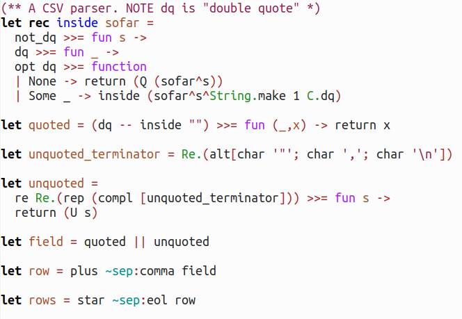
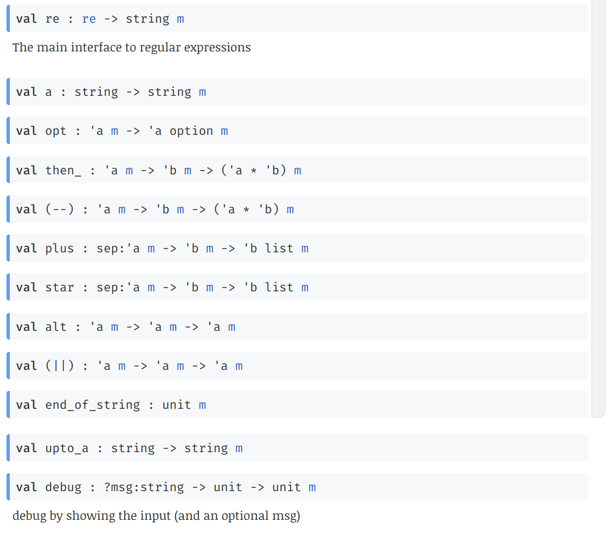

# p0: a simple combinator parsing library

## Introductory example (CSV parser)

## Quick links

* OCamldoc at <https://tomjridge.github.io/p0/> . 
* Examples of use in bin/p0_example.ml

## API fragment

## Features

* Returns at most one result (the monad is the option monad, with None indicating a failed parse)
* Single file library (with a dependency on ocaml-re). 
* Good integration with ocaml-re